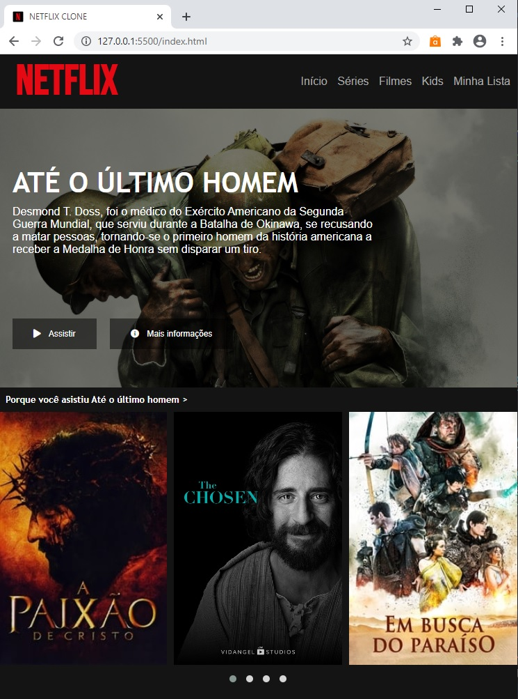

# Recriando a Interface da Netflix

## Este é um projeto desenvolvido no curso da Digital Innovation One junto com o professor [Felipe Aguiar](https://github.com/felipeAguiarCode).

### Tecnologias e Ferramentas utilizadas:

### Entre em contato comigo via:

 

